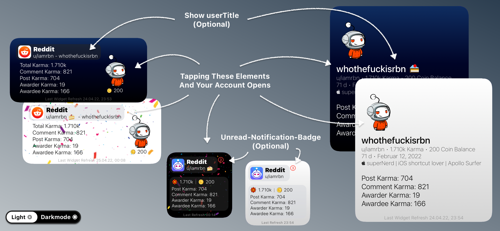
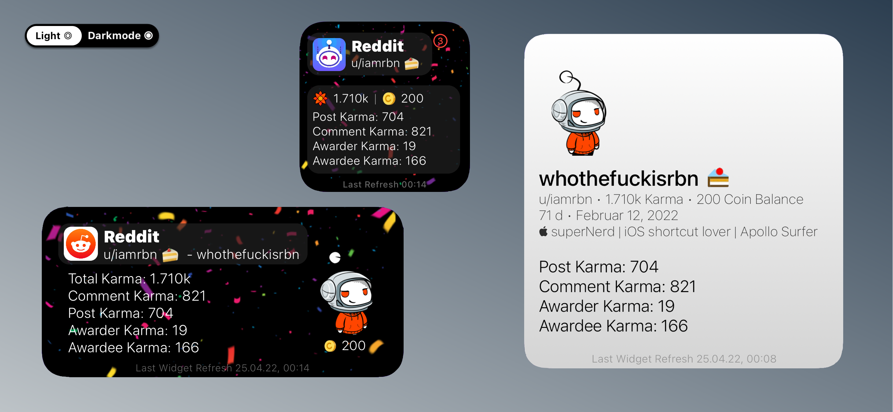
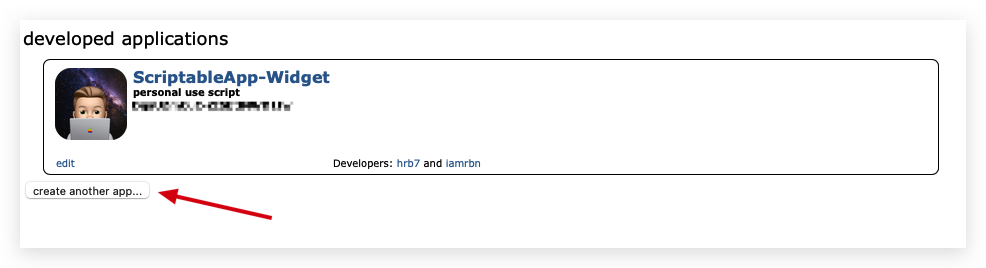
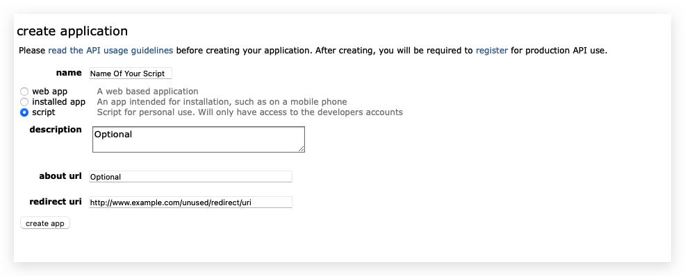
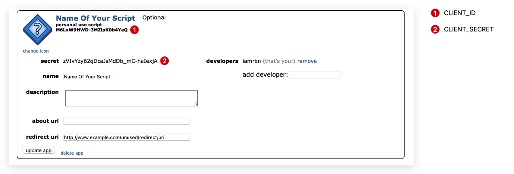
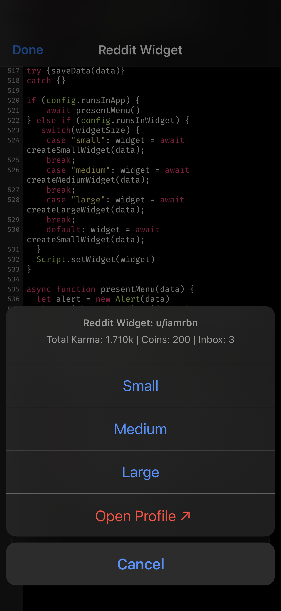

# Reddit User Widget for Scriptable `{}`


Script which shows your  Karma, Coin-Balance, Profile Image, Cakeday, Profile Image etc.

**Update Notes 1.1** (May 04th 2022)
- Updated Function for calculating karma numbers (e.g. 'en-US', 1494 = 1.494K; 20567 = 20.57K; 1000000 = 1M etc.)
- Added Feature notification Badge also for Medium Widget
- Added selfupdate function ([Function](https://github.com/mvan231/Scriptable#updater-mechanism-code-example) is written by the amazing [@mvan231](https://twitter.com/mvan231 "Twitter") - Thx for your Support)

## ✨ FEATURES

### Overview




### Theme
The Widget has a **Dynamic Gradient Background**

 

### Happy Cakeday
Today is your Cakeday!? The widget will tell you subtly.  




## ⚙️ SETUP

### Create Personal Reddit App/Script

1. Login to your Account and go to https://old.reddit.com/prefs/apps/

2. Create new **Personal Script**


3. Click Checkbox "script" and set a redirect uri (e.g. same as in the image)


4. Create App

5. Copy Client_ID & Client_Secret


6. Config Script

```javascript
const USERNAME = 'your-username' //without 'u/'
const PASSWORD = 'your-password'

const CLIENT_ID = 'ABC1234567-XYZ7654321'
const CLIENT_SECRET = 'qwertzuiopasdfghjklyxcvbnm'

const showNotifyBadge = true //smallwidget
const showCoinBalance = true //smallwidget, mediumwidget
const showCakedayConfetti = true //smallwidget, mediumwidget
const showUserTitle = true //mediumwidget, largewidget
const cornerRadiusProfileImg = 0 //Set +50 for a rounded Image
const standardRedditClient = 'Apollo'//Enter Apollo or Reddit
```
Official Reddit API Guidelines: https://github.com/reddit-archive/reddit/wiki/OAuth2
___

### Set Widget Parameter

Default: `Reddit;60`    
For App Icon (Small & Medium) and clickable elements; Widget Refresh Intervall in minutes

Long tab the individual widget an chose Edit "Scriptable" or Edit Widget
set a number for the update intervall (*in minutes*) into the widget Parameter - The script runs every `X` minutes yet.
If it's not filled the script runs default every 60 minutes.

Helper-Shortcut for downloading App-Icons from the App-Store: https://routinehub.co/shortcut/11635/
___

### Run Script In App

By running the scirpt In App it will present a menu including _Username_, _Total Karma_, _Coin Balance_ & _Unread Inbox Count_ at the Top.
You can choose one of the following three options in the sheet: Show small-, medium-, largewidget or open your profile in your standard Reddit-Client ([Create Personal Reddit App/Script - 6. Config Script](https://github.com/iamrbn/Reddit-Widget/edit/main/README.md#-create-personal-reddit-appscript))




## ⬇️ INSTALL SCRIPT & WIDGET

### Install Script
1. Install [Scriptable for iOS `↗`](https://apps.apple.com/us/app/scriptable/id1405459188?ign-mpt=uo%3D4 "App Store")
2. Copy **each line** of the [Script `↗`](https://raw.githubusercontent.com/iamrbn/Reddit-Ridget/main/Reddit-Widget.js)
or download [this](https://routinehub.co/shortcut/10438/) helper shortcut
3. `+` Add new Script


4. Paste it into the new Script
5. Finish

___
### Add Widget To Homescreen
1. Go to your homescreen and long tab anywhere
2. By tapping the `+` it will opens the gallery
3. chose or search for scriptable
4. Chose the widget-size and tap `"Add Widget"`
5. Tap the widget and choose the script, then set `"When Interacting" = "Run Script"` 
6. [Set the widget Parameters](https://github.com/iamrbn/Reddit-Widget/edit/main/README.md#set-widget-parameter) (if you want)
7. Finish

___
### On First Run

It will Downloads and Save the Following Symbols at the directory "Reddit-Widget"

   

```
iCloud Drive/
├─ Scriptable/
│  ├─ Reddit-Widget/
│  │  ├─ karma.png
│  │  ├─ coins.png
│  │  ├─ cakedayApollo.png
│  │  ├─ cakedayConfetti.png
---- alternative symbols ----
│  │  ├─ coins2.png
│  │  ├─ cakedayReddit.png
```
 

___
### Known Issues!

- Long **usernames** may not display correctly (Small-Widget)
- Long **usertitles** may not be displayed correctly in conjunction with **username** (Medium-Widget)
- High karma values (>10k) may not be displayed correctly (Small-Widget)

##

<h2 style="font-size:1"
<p align="center" style="font-size:10vw">
   <a href="https://github.com/iamrbn/Reddit-Widget/blob/main/README.md#reddit-user-widget-for-scriptable-"> ⬆️ Jump Back to Start </a>
</p>
</h2>

<a href="https://reddit.com/user/hrb7">
  
</a>

<a href="https://reddit.com/user/iamrbn">
  
</a>

<a href="https://twitter.com/iamrbn_">
  
  </a>
