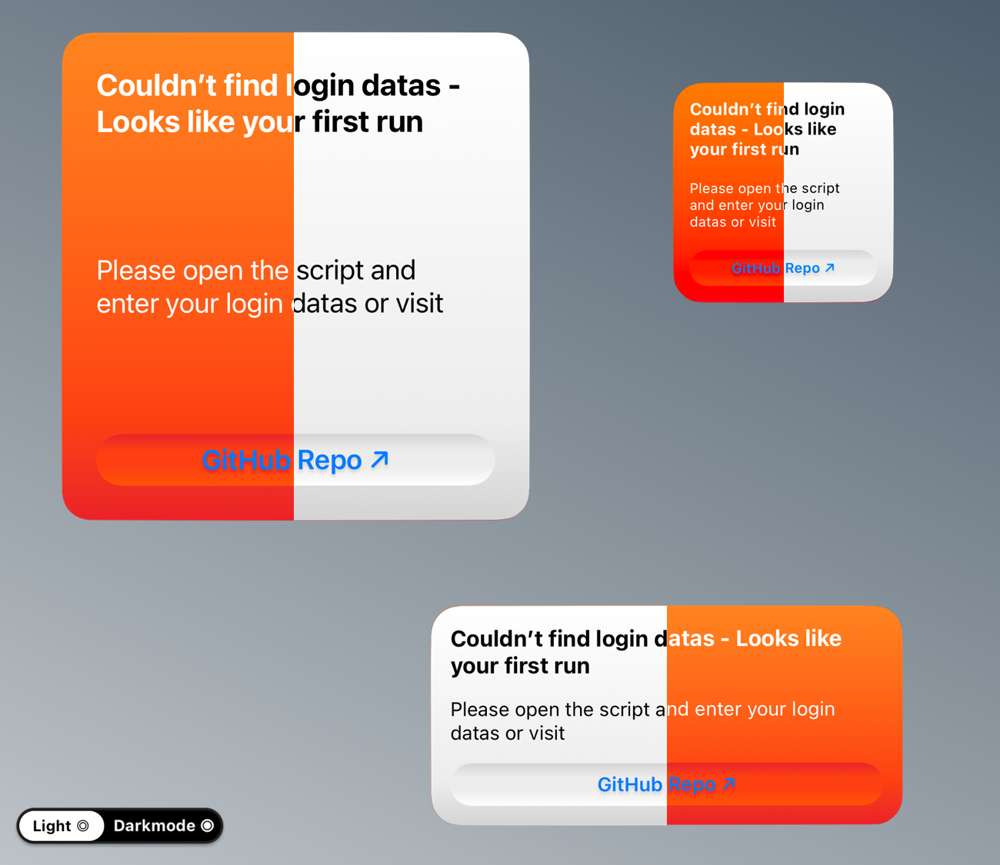
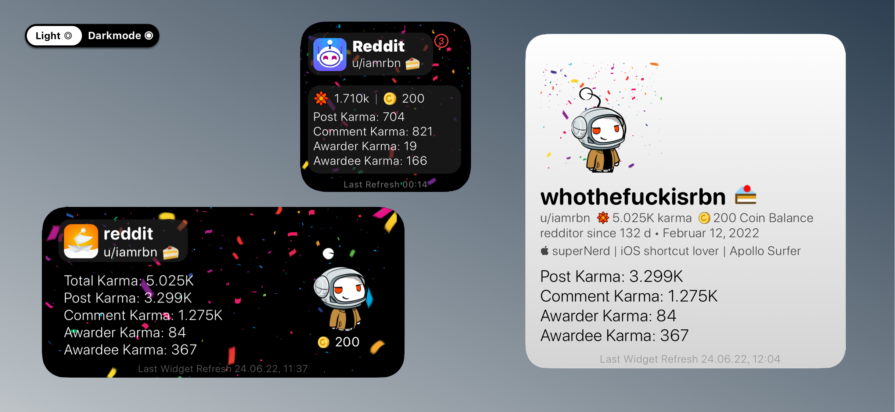
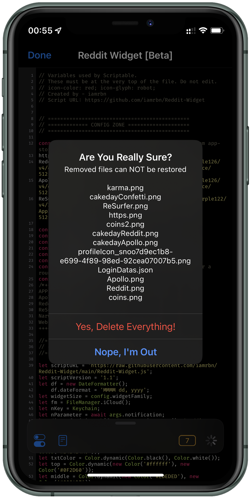

#  Reddit User Widget for Scriptable


Widget which shows your  Karma,  Cakeday, Profile Image etc.


<br>
<br>

**1.3 Update Notes** (December 15th 2023)
   - Removed the most 3rd party app icons due to recent api changes from reddit
   - Added alternative reddit icons, like alienblue, classic & black
   - Coin balance is replaced with your cakeday/account age
   - The formatting of the karma values has been adjusted slightly
   - Added the option to set the widget background gradient into reddit-orange (You have to move the comment brackets (```/*...*/```) to the default value)
   - Small Code improvements

**1.2 Update Notes** (July 20th 2022)
   - Script Saves and pulls reddit login datas on device (~ iCloud/Scriptable/Reddit-Widget/LoginDatas.json)
   - Downloads once profile image & app icons to iCloud for less mobile data usage
   - Added 'Delete Menu ⌦' for Downloaded Files
   - added first / error widget for all sizes
   - Added unread messages badge for large widget, too!
   - Added the reddit web-favicon and ReSurfer (_amazing reddit client, check it out_) as icon option.
   - Added the option to use the web-browser instead of reddit, apollo or ReSurfer app (_If you also have the reddit app installed, iOS will first open the reddit app instead of the browser_)
   - Fixed bug where long karma numbers may displayed cutted off in the small-widget
   - Small design and functionality improvements

<br>

**1.1 Update Notes** (May 05th 2022)
   - Updated Function for calculating karma numbers `(e.g. 1494 = 1.494K; 20567 = 20.57K; 1000000 = 1M etc.)`
   - Added Feature notification Badge also for Medium Widget
   - Added selfupdate function[^1]

<br>

**Known Issues**
   - Long **usernames** (_up to 13 symbols_) may not display correctly (_Small-Widget_)
   - Long **usertitles** may not be displayed correctly in conjunction with **username** (_Medium-Widget_)
   - and some small other bugs...

<br>

**Next Update Includes**
   - Push-Notifications when today is your Cakeday and new reached Karma score (_25 point steps_)
   - Lockscreen Widgets

<br>


## Widget Overview


### Theme
The Widget has a **Dynamic Gradient Background**

  

Change the background gradient to always Reddit Styled


You only have to change the position of the comment brackets

from:
```Javascript
//Standard dynamic colors for background gradient
let top = Color.dynamic(new Color('#ffffff'), new Color('#0F2D60'))
let middle = Color.dynamic(new Color('#EDEDED'), new Color('#000427'))
let bottom = Color.dynamic(new Color('#D4D4D4'), new Color('#000000'))

/*
//Orange background gradient like the official reddit app icon
let top = new Color('#FF8420')
let middle = new Color('#FD3F12')
let bottom = new Color('#EA2128')
*/
...
```

to:
```Javascript
/*
//Standard dynamic colors for background gradient
let top = Color.dynamic(new Color('#ffffff'), new Color('#0F2D60'))
let middle = Color.dynamic(new Color('#EDEDED'), new Color('#000427'))
let bottom = Color.dynamic(new Color('#D4D4D4'), new Color('#000000'))
*/

//Orange background gradient like the official reddit app icon
let top = new Color('#FF8420')
let middle = new Color('#FD3F12')
let bottom = new Color('#EA2128')
...
```

<br>

### First Run
When you add the widget but also saved your login datas (via script) youll get the Error/First Run Widget.    
Open the Script an Enter your Datas from Reddit.



<br>

### Happy Cakeday
Today is your Cakeday!? The widget will tell you subtly.  



<br>

## ⚙️ SETUP

### Create Personal Reddit App/Script

1. Login to your Account and go to https://old.reddit.com/prefs/apps/

2. Create new **Personal Script**


3. Click Checkbox "script" and set a redirect uri (e.g. same as in the image)


4. Create App

5. Copy Client_ID & Client_Secret


6. Config Script

```javascript
const refreshInt = 90 //in minutes
const enableNotifications = true //beta
const showNotifyBadge = true //all widget sizes
const showUserTitle = true //medium- & large widget
const numberFormatting = 'de-DE' //For karma valuesen. e.g.: en-EN, en-IN etc.
const widgetIcon = 'orange' //small- & medium widget; available icons: alienblue, black, classic, orange, roundorange, oldReddit, reddit, apollo;
```
Official Reddit API Guidelines: https://github.com/reddit-archive/reddit/wiki/OAuth2

Helper-Shortcut for downloading App-Icon-URLs from the App-Store: https://routinehub.co/shortcut/11635/
___

### Run Script In App

By running the scirpt In App it will present a menu including _Username_, _Total Karma_, _Coin Balance_ & _Unread Inbox Count_ at the Top.
You can choose one of the following three options in the sheet: Show small-, medium-, largewidget or open your profile in your standard Reddit-Client ([Create Personal Reddit App/Script - 6. Config Script](https://github.com/iamrbn/Reddit-Widget/edit/main/README.md#-create-personal-reddit-appscript))


### Delete Menu




## Installing

### Install Script
1. Install [Scriptable for iOS `↗`](https://apps.apple.com/us/app/scriptable/id1405459188?ign-mpt=uo%3D4 "App Store")
2. Copy **each line** of the [Script `↗`](https://raw.githubusercontent.com/iamrbn/Reddit-Ridget/main/Reddit-Widget.js)
or download [this](https://routinehub.co/shortcut/10438/) helper shortcut
3. `+` Add new Script


4. Paste it into the new Script
5. Finish

### Add Widget To Homescreen
1. Go to your homescreen and long tab anywhere
2. By tapping the `+` it will opens the gallery
3. chose or search for scriptable
4. Chose the widget-size and tap `"Add Widget"`
5. Tap the widget and choose the script, then set `"When Interacting" = "Run Script"` 
6. [Set the widget Parameters](https://github.com/iamrbn/Reddit-Widget/edit/main/README.md#set-widget-parameter) (if you want)
7. Done

### On First Run

It will Downloads and Save the Following Symbols at the directory "Reddit-Widget"

      
    

```
iCloud Drive/
├─ Scriptable/
│  ├─ Reddit-Widget/
│  │  ├─ karma.png
│  │  ├─ cakedayApollo.png
│  │  ├─ cakedayConfetti.png
│  │  ├─ profileIcon.png
│  │  ├─ classic.png
│  │  ├─ orange.png
│  │  ├─ roundorange.png
│  │  ├─ oldReddit.png
│  │  ├─ black.png
│  │  ├─ alienblue.png
│  │  ├─ arrowsLS.png
---- alternative symbols ----
│  │  ├─ cakedayReddit.png
│  │  ├─ apollo.png
│  │  ├─ reddit.png
```
  


<h2 style="font-size:1"
<p align="center" style="font-size:10vw">
   <a href="https://github.com/iamrbn/Reddit-Widget/blob/main/README.md#reddit-user-widget-for-scriptable-"> ⬆️ Jump Back To Start </a>
</p>
</h2>
 
<p align="center">
  <a href="https://reddit.com/user/iamrbn/">
    
  </a>
  <a href="https://twitter.com/iamrbn_/">
    
  </a>
  <a href="https://mastodon.social/@iamrbn">     
     
  </a>
</p>


[^1]:[Function](https://github.com/mvan231/Scriptable#updater-mechanism-code-example "GitHub Repo") is written by the amazing [@mvan231](https://twitter.com/mvan231 "Twitter") - Thx for your Support
