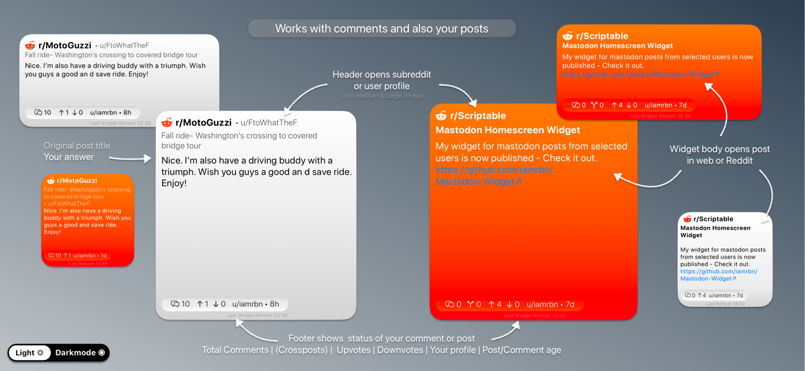
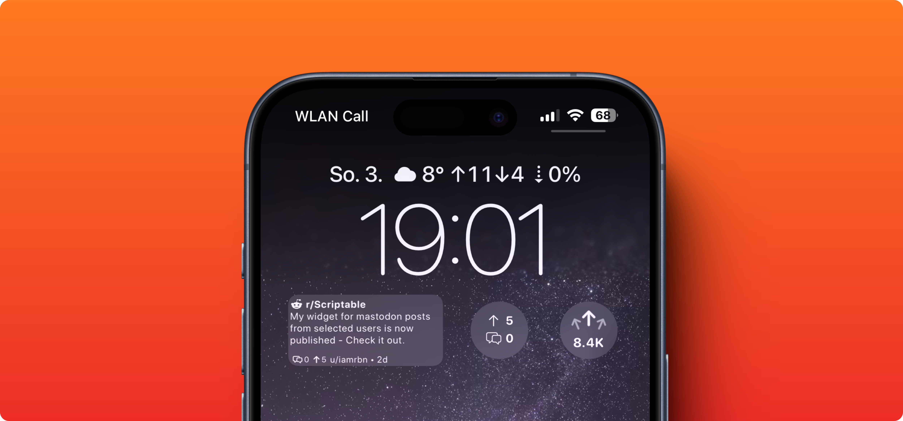
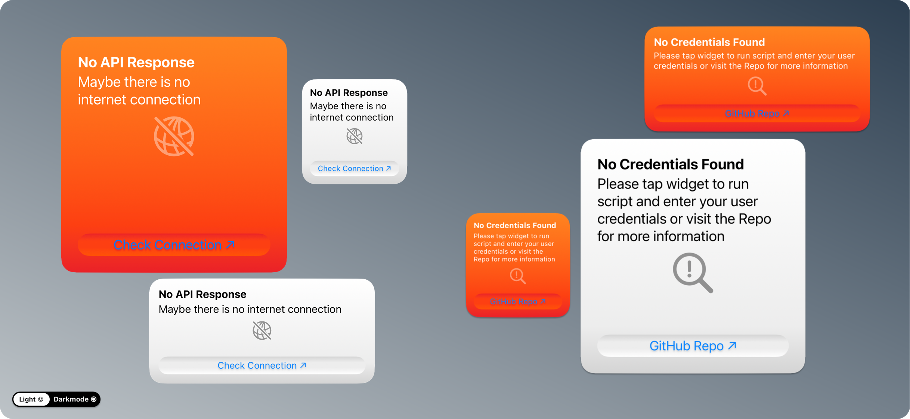
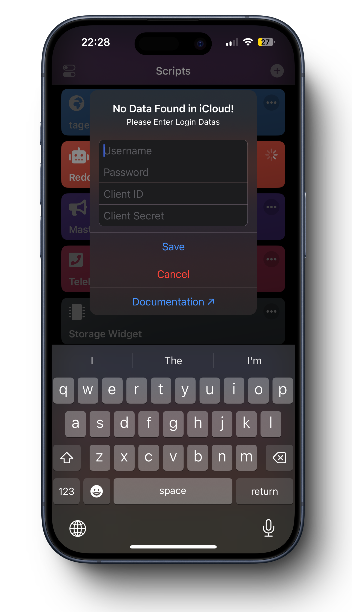

#  Reddit widget for [Scriptable-App](https://scriptable.app/)


This widget shows your  Karma,  Cakeday and Profile Image on your home and lockscreen

**Karma Widget**

<br>
<br>


This version of the widget shows your last Post on your home and lockscreen

**Last Post Widget**

<br>


<br>
<br>


<details open>
   <summary><b>1.5 Update Notes (November 11th 2024)</b></summary>
   
   - Module file has been added with parts of the original script for performance improvements
   - Last post lockscreen-widgets have been revised
   - Also added last post homescreen-widgets (small, medium, large)
   - Removed some parts of the delete menu
   - Some parts of the code that were not used have been removed
   - General code improvements
</details>


<br>

   <details>
   <summary><b>1.4.1 Update Notes (January 17th 2024)</b></summary>
   
   - Added a second Circular-Lockscreen-Widget, which shows upvotes and comments of your recent post/comment
   - Added also Rectangular-Lockscree-Widget with the same functions    
-> [Jump To Lockscreen Widgets](https://github.com/iamrbn/Reddit-Widget/blob/main/README.md#widget-parameter)
   </details>


   <details>
   <summary><b>1.4 Update Notes (December 27th 2023)</b></summary>
   
   - Added Circular-Lockscreen-Widget. It shows your total karma
   - Small improvements of the Large-Widget
   </details>

   <details>
   <summary><b>1.3.1 Update Notes (December 19th 2023)</b></summary>
   
   - Removed 'Open Profile' dialog
   - Added basics for lockscreen widgets
   </details>

   <details>
   <summary><b>1.3 Update Notes (December 15th 2023)</b></summary>
   
   - Removed the most 3rd party app icons due to recent api changes from reddit
   - Added alternative reddit icons, like alienblue, classic & black
   - Coin balance is replaced with your cakeday/account age
   - The formatting of the karma values has been adjusted slightly
   - Small Code improvements
   - Added the option to set the widget background gradient into reddit-orange
   (You have to move the comment brackets (```/*...*/```) to the default value)
   </details>

   <details>
   <summary><b>1.2 Update Notes (July 20th 2022)</b></summary>
   
   - Script Saves and pulls reddit login datas on device (~ iCloud/Scriptable/Reddit-Widget/LoginDatas.json)
   - Downloads once profile image & app icons to iCloud for less mobile data usage
   - Added 'Delete Menu ⌦' for Downloaded Files
   - added first / error widget for all sizes
   - Added unread messages badge for large widget, too!
   - Added the reddit web-favicon and ReSurfer (_amazing reddit client, check it out_) as icon option.
   - Added the option to use the web-browser instead of reddit, apollo or ReSurfer app (_If you also have the reddit app installed, iOS will first open the reddit app instead of the browser_)
   - Fixed bug where long karma numbers may displayed cutted off in the small-widget
   - Small design and functionality improvements
   </details>

   <details>
   <summary><b>1.1 Update Notes (May 05th 2022)</b></summary>
   
   - Updated Function for calculating karma numbers `(e.g. 1494 = 1.494K; 20567 = 20.57K; 1000000 = 1M etc.)`
   - Added Feature notification Badge also for Medium Widget
   - Added selfupdate function[^1]
   </details>


<br>

## Overview


### Themes
The Widget has a **Dynamic Gradient Background**

  

<br>

### Error Widegt
The error widget is displayed if you have not yet entered any user credentials or if there is no response from the reddit API.    
Reasons for this could be, for example, no internet connection.



<br>

### Happy Cakeday Buddy
Today is your Cakeday!? The widget will tell you subtly.  


<br>

## ⚙️ SETUP

### Create Personal Reddit App/Script
**Official Reddit API Guidelines: https://github.com/reddit-archive/reddit/wiki/OAuth2**

1. Login to your Account and go to https://old.reddit.com/prefs/apps/

2. Create new **Personal Script**


3. Click Checkbox "script" and set a redirect uri (e.g. same as in the image)


4. Create App

5. Copy Client_ID & Client_Secret


6. Run Script in-app and enter your created user credentials


___

### Config Script
You can set your own constants at the top of the script

```javascript
// ===========================================
// ========== START CONFIG ZONE ==============
 
let refreshInt = 60 //refreshinterval as number in minutes
let showNotifyBadge = true //all home-widget sizes
let showUserTitle = false //medium- & large widget
let numberFormatting = 'de-DE' //For karma valuese. e.g.: en-EN, en-IN etc.
let widgetIcon = 'alienblue' //small- & medium widget; available icons: alienblue, black, classic, orange, roundorange, oldReddit, reddit, apollo;
let widgetType = 'karma' //karma or post

// =========== END CONFIG ZONE ================
//=============================================

```
<br>

### Widget Parameter
You can set ```Karma``` or ```Post``` individual in each Widgets.    
'Karma' is not for the rectangular lockscreen widget available!

<br>

### Run Script In App

By running the scirpt In App it will present a menu with the following options.    
_'Report Bug' Saves just a JSON with the reddit API response. You've to share it manually to get help!_


    

</br>

## On First Run

It will Downloads and Save the Following Symbols and a JavaScript Module at the directory "Reddit-Widget"

        
   

```
iCloud Drive/
├─ Scriptable/
│  ├─ Reddit-Widget/
│  │  ├─ redditModule.js
│  │  ├─ karma.png
│  │  ├─ cakedayApollo.png
│  │  ├─ cakedayConfetti.png
│  │  ├─ snoovatar_xxx.png
│  │  ├─ oldReddit.png
│  │  ├─ classic.png
│  │  ├─ orange.png
│  │  ├─ black.png
│  │  ├─ alienblue.png
│  │  ├─ arrowsLS.png
│  │  ├─ redditLS.png
---- alternative symbols ----
│  │  ├─ cakedayReddit.png
│  │  ├─ apollo.png
```
 


<h2 style="font-size:1"
<p align="center" style="font-size:10vw">
   <a href="https://github.com/iamrbn/Reddit-Widget/blob/main/README.md#reddit-user-widget-for-scriptable-"> ⬆️ Jump Back To Start </a>
</p>
</h2>
 
<p align="center">
  <a href="https://reddit.com/user/iamrbn/">
    
  </a>
  <a href="https://twitter.com/iamrbn_/">
    
  </a>
  <a href="https://mastodon.social/@iamrbn">     
     
  </a>
</p>


[^1]:[Function](https://github.com/mvan231/Scriptable#updater-mechanism-code-example "GitHub Repo") is written by the amazing [@mvan231](https://twitter.com/mvan231 "Twitter") - Thx for your Support
